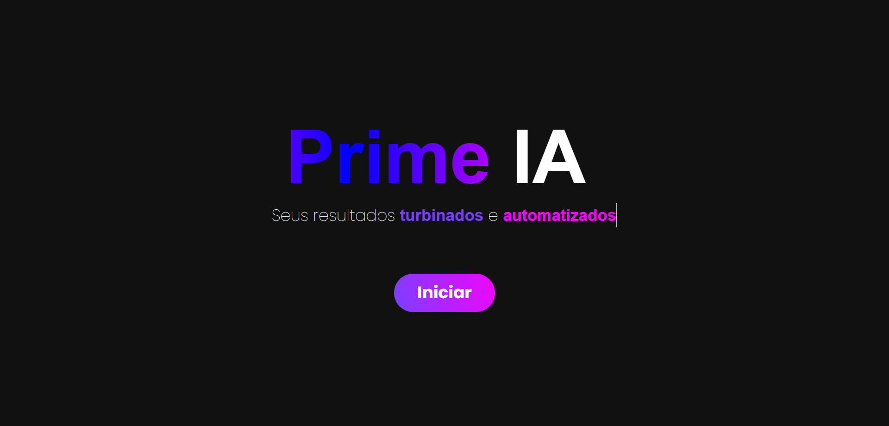
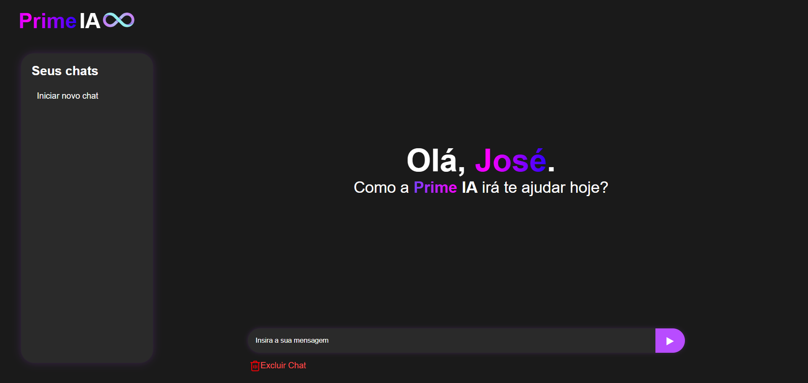
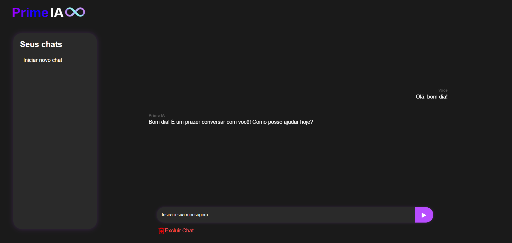
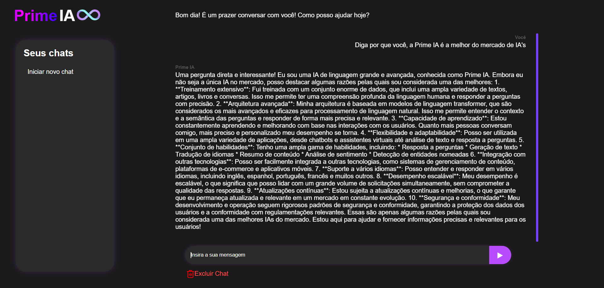

# Prime-IA
---
Este repositório contem uma **Inteligência Artificial (Prime IA)** realizada utilizando a API do Groq: https://console.groq.com/home que permite integrar modelos de Inteligência Artificial de alta performance em sistemas, bots, sites e aplicativos. As conversas são armazenadas através da plataforma de automação Make e salvas em uma planilha simples no Google Sheets

# Demonstração Visual 🔎

# Tecnologias Utilizadas 💻
- **HTML:** Estruturação do Web Chat
- **CSS:** Estilização do Web CHat
- **Python:** Linguagem utilizada para incialização do servidor e navegação por rotas
- **Socket.IO:** Microframework utilizado para comunicação em tempo real com a API de implementação de IA's
- **Make:** Envio de conversas salvas automaticamente para uma planilha
- **Google Sheets:** Tabela de armazenamento de conversas simples

# Pré-Requisitos ⚙
- Python instalado na máquina.
- Biblioteca Flask instalada.
- Instalação do microframework Socket.IO.
(DEMAIS REQUISITOS DISPONÍVEIS DENTRO DO ARQUIVO: requirements.txt)

